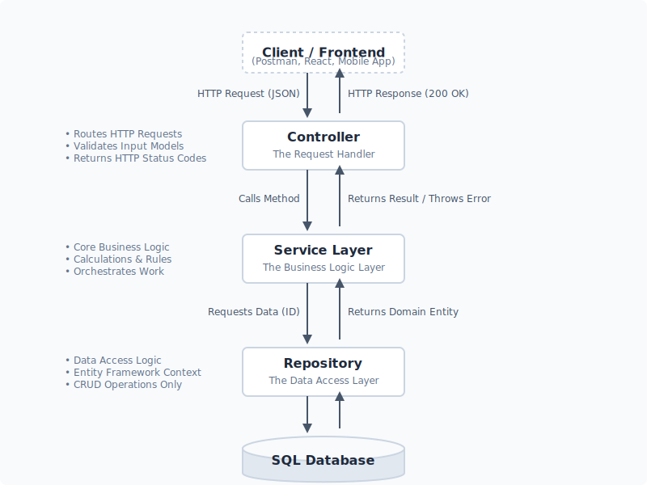

## API Endpoints

The base URL for these endpoints is `/api/Products`.

| HTTP Method | Endpoint | Description | Request Body |
| :--- | :--- | :--- | :--- |
| `GET` | `/api/Products` | Retrieves a list of all products | None |
| `POST` | `/api/Products` | Creates a new product | `Product` object (JSON) |
| `GET` | `/api/Products/{id}` | Retrieves a specific product by its `id` | None |
| `PUT` | `/api/Products/{id}` | Updates an existing product by its `id` | `Product` object (JSON) |
| `DELETE` | `/api/Products/{id}` | Deletes a specific product by its `id` | None |

## The Flow



`This code represents a classic ASP.NET Core API controller before the introduction of a Service Layer. In this architecture, the controller is acting as a "fat controller," meaning it takes on more responsibilities than it ideally should.`
```c#
[Route("api/[controller]")]
[ApiController]
public class ProductsController:ControllerBase
{


    private readonly AppDbContext _context;

    public ProductsController(AppDbContext context)
    {
        _context = context;
    }
    
    
    [HttpGet]
    public IActionResult GetProducts()
    {
        return Ok(_context.Products);
    }

    [HttpPost]
    public IActionResult AddProduct(Product product)
    {

        _context.Products.Add(product);
        _context.SaveChanges();
        return Ok(_context.Products);
    }


    [HttpGet("{id}")]
        public IActionResult GetProductbyId(int id)
        {
            
            var product = _context.Products.FirstOrDefault(p => p.ID == id);
            return Ok(product);
        }

    [HttpPut("{id}")]
    public IActionResult UpdateProduct(Product update, int id)
    {
        var res = _context.Products.FirstOrDefault(p => p.ID == id);

        res.Name = update.Name; 
        res.Price = update.Price;
        _context.SaveChanges();

        return Ok(res);
    }

    [HttpDelete("{id}")]
    public IActionResult DeleteProduct(int id)
    {
        var delete = _context.Products.FirstOrDefault(p => p.ID == id);

        _context.Products.Remove(delete);
        _context.SaveChanges();

        return Ok(_context.Products);
    }

```

By refactoring this code to include a Service Layer, we will extract all the _context logic into a dedicated service. The controller will then become much "thinner" it will simply receive the HTTP request, hand the data off to the Service Layer to do the heavy lifting, and return the appropriate HTTP status code.

Now I separated the Dbcontext from the Controller the service deals with the DbContext and the Controller talks with Service

```c#
public interface IProductService
{
    IEnumerable<Product> GetAllProducts();
    Product GetProductById(int id);
    Product AddProduct(Product product);
    Product UpdateProduct(int id, Product update);
    bool DeleteProduct(int id);   
}

[Route("api/[controller]")]
[ApiController]
public class ProductsController:ControllerBase
{
    
    private readonly IProductService _service;
    public ProductsController(IProductService service)
    {
        _service = service;
    }
    
    [HttpGet]
    public IActionResult GetProducts()
    {
        return Ok(_service.GetAllProducts());
    }

    [HttpPost]
    public IActionResult AddProduct(Product product)
    {
        
        var createdProduct = _service.AddProduct(product);

        return Ok(createdProduct);
    }


    [HttpGet("{id}")]
        public IActionResult GetProductbyId(int id)
        {

            var product = _service.GetProductById(id);
            
            return Ok(product);
        }

    [HttpPut("{id}")]
    public IActionResult UpdateProduct(Product update, int id)
    {
        var res = _service.UpdateProduct(id, update);

        return Ok(res);
    }

    [HttpDelete("{id}")]
    public IActionResult DeleteProduct(int id)
    {
        var delete = _service.DeleteProduct(id);
        return Ok(delete);
    }
    
}
```
